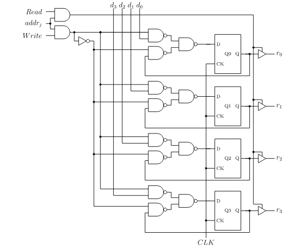
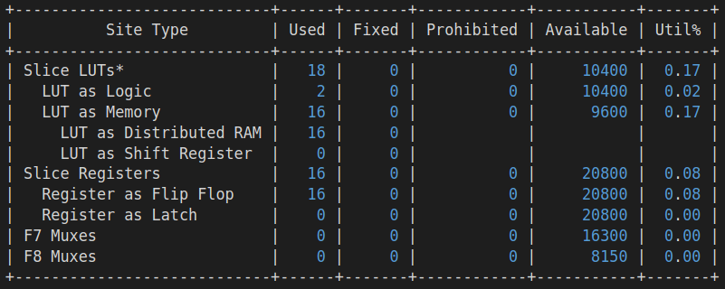

# Computer Architecture Final Project
By Charlie Babe and Charlotte Ramiro  <br> <br>
 
 
## Introduction
 
We chose to do our final project for our Computer Architecture class by implementing a static random-access memory (SRAM) module in SystemVerilog and analyzing it with a custom testbench. We wanted to explore the different architectures that have been used to create SRAM in the past, as well as the direction that random-access memory (RAM) is taking with modern architecture practices. Furthermore, we wanted to improve not only our own understanding of RAM, but our classmates' as well; therefore, we want our project to be thoroughly-documented, comprehensive, able to provide guidelines on creating SRAM, and provide questions to incite deeper understanding from the reader.  <br> 
 
 
 
## What is RAM?
 
Random-access memory is a form of computer memory that can be read and changed in any order and is typically used to store working data or machine code. Unlike direct-access data storage such as CDs and DVDs, RAM is able to access data stored in any part of the physical memory in around the same amount of time, making it convenient for data that needs to be accessed frequently and in no particular order. The most common types of RAM are forms of volatile memory, meaning that stored information is lost when power is lost; non-volatile RAM has also been developed, but we chose to focus on volatile RAM since it is its most common application[1].
 
The two main types of volatile RAM are dynamic RAM (DRAM) and static RAM (SRAM, which we will be recreating in this project. As its name suggests, DRAM is constantly changing. It requires an external memory refresh which periodically rewrites the data in its internal capacitors and restores them to their original charge[2].
 
 
## The Past and Future of RAM
RAM was first created in 1947 with the use of the Williams tube[3]. The Williams tube was the first high speed electronic memory, it used a cathode ray tube to store the data using electrically charged spots[4]. Then Frederick Viehe in 1947 invented the magnetic-core memory which worked by threading wire through magnetized metal rings[5]. Each of the rings, depending on it's maginitizion stored 1 bit of data. Today RAM or solid state memory which was invented in 1968 by Robert Dennard uses a transistor to store bits of data[6].
 
RAM is constantly being improved, to reduce its physical size and power consumption and increase it's access speed.RAM following Moore's Law has gotten exponentially smaller over the years, but the speed of accessing memory has not kept pace with the increase of CPU speed. From 1986 to 2000, CPU speed increased at an annual rate of 55% while RAM speed only increased by 10% [7]. Technologies to combat this "Memory Wall'' are currently being developed.
 
## Our Implementation and Testbench
Our behourial SRAM implementation can be seen in the ```SRAM.sv``` file, while our testbench is in ```Test_SRAM.sv```. To change the size of the SRAM edit the parameter ```DAT``` and ```DPTH``` in ```SRAM.sv```. To test the SRAM run ```test_sram``` in the terminal which writes and then reads from the same address in the SRAM.

## Hypothesis

Figure 1: One 4 bit address of SRAM.<br>
SRAM is composed of addressable registers that can be read and written to. As shown in Figure 1 the inputs of SRAM are an address, a read, and a write, the output if using reading from a register comes from the tri states connected to the register. The address input goes into a decoder which selects the sram to read from or write to. As the size of the SRAM increases the size of the decoder also increases which results in a longer critical path and therefore a longer propagation delay and a longer time to retrieve memory. If the decoder was created using a binary tree, each time the decoder size or number of addresses doubled the propagation delay time of a 1 to 2 decoder would be added to the existing time it takes to read or write to an address.

 
## Analysis and Results
To run an analysis of the SRAM to determine it's critical path and what the SRAM synthesizes on a 7a15t-cpg236 device run ```analyze_sram_system```. To test different sizes of RAM, change ```DAT``` and ```DPTH``` in ```SRAM.sv``` and assign ports in ```SRAM.xdc```. The folders ```16wide```, ```8wide```, ```4wide``` and ```2wide``` contain the results of an analysis of the SRAM for SRAM with address of 16, 8, 4 and 2 respectively. The results show that the SRAM synthesizes to a combination of Look Up Tables (LUTs) and Shift Registers.

Figure 2: The sythesis of 16 addressable SRAM registers.<br>
The amount of "LUT as Memory" and "Register as Flip Flop" was the same as the size of the memory while the amount of "LUT as Logic" was always two for the four sizes of SRAM we analyzed. The critical path was the same for all four sizes of SRAM which could be the result of the memory optimizations during sythesis.
 
## Questions for Understanding
What electronic component is Solid State RAM made of?
What is a current issue affecting RAM use in CPUs?

## Work Cited
1. “Random-Access Memory.” Wikipedia, Wikimedia Foundation, 7 Dec. 2021, https://en.wikipedia.org/wiki/Random-access_memory. 
2. “Dynamic Random-Access Memory.” Wikipedia, Wikimedia Foundation, 16 Dec. 2021, https://en.wikipedia.org/wiki/Dynamic_random-access_memory. 
3. “Computer History Museum.” Williams-Kilburn Tubes, https://www.computerhistory.org/revolution/memory-storage/8/308. 
4. “What Is RAM (Random-Access Memory)?” What Is RAM (Random-Access Memory)?, 30 June 2020, https://www.computerhope.com/jargon/r/ram.htm. 
5. “Computer History Museum.” Magnetic Core Memory, https://www.computerhistory.org/revolution/memory-storage/8/253. 
6. “National Inventors Hall of Fame Inductee Robert Dennard Invented Dram.” National Inventors Hall of Fame Inductee Robert Dennard Invented DRAM, https://www.invent.org/inductees/robert-h-dennard. 
7. Mills, Matt. “What Technologies Will the Ram of the Future Bring Us?” ITIGIC, 3 Dec. 2020, https://itigic.com/what-technologies-will-ram-of-the-future-bring-us/. 
8. Plantz, Robert G. “Introduction to Computer Organization: ARM Assembly Language Using the Raspberry Pi.” Memory Organization, https://bob.cs.sonoma.edu/IntroCompOrg-RPi/sec-memorg.html. 
